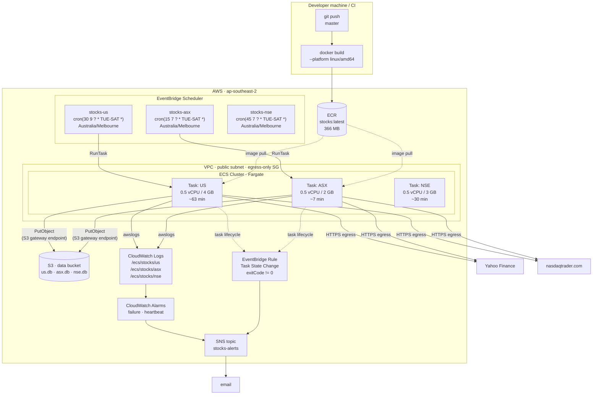
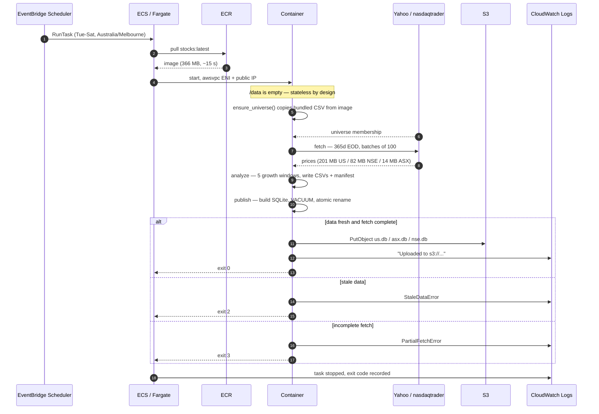
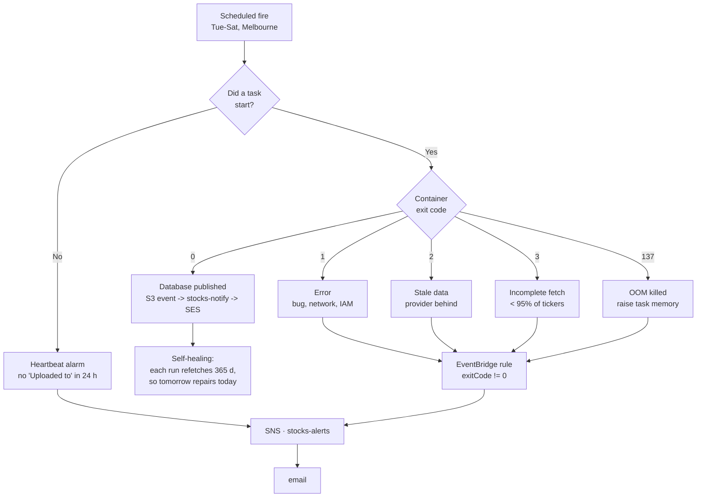
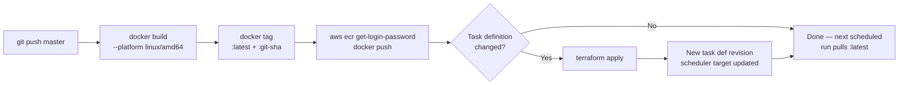

# AWS Deployment Spec — Stock Growth Screener

**Status:** Draft for review
**Date:** 2026-08-23
**Target account:** supplied via `terraform.tfvars` (not committed)
**Target region:** `ap-southeast-2` (Sydney)
**Schedule:** Tue–Sat, `Australia/Melbourne` — ASX 07:15, NSE 07:45, US 09:30

---

> **Placeholders.** This document is public. `${AWS_ACCOUNT_ID}`,
> `${DATA_BUCKET}` and the alert address are deliberately not written down
> here — they live in `infra/terraform.tfvars`, which is gitignored. Substitute
> them locally; do not commit the resolved values.

---

## 1. Purpose and scope

Run the existing pipeline on a daily schedule in AWS with no host involvement:
build the image once, run it on Fargate, publish the SQLite databases to S3,
and get told when something breaks.

**In scope:** ECR, ECS on Fargate, EventBridge Scheduler, S3, CloudWatch Logs
and Alarms, SNS, IAM, and the VPC plumbing the task needs.

**Out of scope:** serving the databases to consumers (a Lambda/API in front of
S3 is a separate piece of work), multi-region, and any change to how growth is
measured.

---

## 2. What exists today

The pipeline is a single image driven by `src/run.py`, which takes a job name
and a universe:

```
python src/run.py all --exchange US --instrument-type stocks --period 365
```

Jobs are `fetch`, `analyze`, `publish`, and `all`. There is deliberately no
universe job: membership is decided before the image is built, by
`scripts/refresh_universe.py`, and the pipeline only ever reads the committed
CSV. Exit codes are
already stable and documented, which the alarm design in §8 depends on:

| Code | Meaning |
|---|---|
| 0 | Success |
| 1 | Error |
| 2 | Price data too stale to screen |
| 3 | Fetch too incomplete to publish |

### 2.1 Measured behaviour

All figures below were measured on 2026-08-23 against the live provider, using
the same code the container runs.

**These are host figures, and they do not transfer to Fargate.** See §2.2: the
same US run takes 63 minutes on Fargate against 3m42s here. They are kept
because they are what memory sizing is derived from; runtime and cost come
from the Fargate measurements instead.

| Stage | US (5750 tickers) | ASX (402 tickers) | NSE (2531 tickers) |
|---|---|---|---|
| `fetch` | 3 m 42 s, **950 MB peak** | 17 s | 1 m 19 s |
| `analyze` | 5 s, 402 MB peak | 0.3 s | ~15 s |
| `publish` + upload | ~2 s | ~1 s | ~2 s |
| **`all`, end to end** | **~4 min** | **~1 min** | **1 m 38 s, 614 MB peak** |

Artefact sizes:

| Artefact | US | ASX | NSE |
|---|---|---|---|
| Universe CSV | 1.0 MB (13,135 symbols) | 24 KB (404 symbols) | 230 KB (2,531 symbols) |
| EOD price CSV | 201 MB | 14 MB | 82 MB |
| Published database | 884 KB | 48 KB | 1.3 MB |
| Container image | 366 MB (shared) | | |

The NSE column was measured 2026-08-30 on the same host, against the full
2,531-symbol universe from `EQUITY_L.csv`. Its peak is a whole-run figure
(`/usr/bin/time -v` over `all`) rather than a per-stage one, which is what
§6.2 sizes the task from. The published database is larger than the ASX one
despite a smaller screen because NSE publishes weekly price history for every
matched ticker.

These figures predate the removal of the in-run universe sync, which cost 6 s
on US and 43 s on ASX — the ASX one dominated its ~60 s run, because that
market has no bulk symbol directory and the job fell back to per-ticker
provider lookups. Both runs are that much shorter now, and neither touches the
universe at all.

### 2.2 The same runs on Fargate

Measured 2026-08-23 from the first real task runs, billed duration taken from
`pullStartedAt` to `stoppedAt`:

| | Host | Fargate | Ratio |
|---|---|---|---|
| US `all` | 3 m 42 s | **63.3 min** | 17x |
| ASX `all` | ~1 min | **6.7 min** | 6.7x |

Both exited 0 and fetched the same data — 5749/5750 US tickers, identical to
the host run. **Zero `YFRateLimitError` in 63 minutes**: the provider is not
throttling with errors, it simply answers AWS egress far more slowly than a
residential connection. US batches of 100 tickers took ~63 s each on Fargate
against ~3.5 s on the host.

Two consequences, both of which the design absorbs rather than fights:

- **Sizing.** The run is network-bound, not compute-bound, so vCPU buys
  nothing. The US task is 0.5 vCPU: the extra 0.5 would spend an hour idle at
  double the rate. Memory stays at 4 GB, sized from the 950 MB measured peak.
- **Cost.** Fargate bills wall-clock per second, so a 17x longer run costs 17x
  more. §10 is priced on the Fargate figures, not the host ones.

Nothing else is affected. There is no Fargate task timeout to exceed, and a US
run starting at 09:30 and finishing around 10:35 collides with nothing — the
ASX schedule at 07:15 and the NSE one at 07:45 are independent tasks that have
already finished.

---

## 3. Key design decisions

### D1 — The task is stateless. No EFS.

**This is the decision that keeps the architecture small**, so it is worth
justifying carefully. Every artefact the pipeline produces is regenerated from
scratch on each run:

- **Universe** — not produced by the run at all. The committed CSV is copied
  out of the image at the start of every run and read; nothing adds a ticker
  or removes one. It is therefore trivially a function of the image rather
  than of the previous run.
- **EOD prices** — refetched in full every run (`--period 365`).
- **Databases** — rebuilt from that run's CSVs, then published atomically.

So a container that starts with an empty `/data` produces byte-equivalent
output to one that starts with last night's volume. **No EFS, no S3 state
sync, no volume of any kind.** The image is the source of truth for membership
in both markets: a ticker arrives or leaves by a commit to `config/*.csv` and
an image build, never by a decision taken inside a run.

The 201 MB EOD CSV lives on Fargate's ephemeral storage (20 GB by default),
which is ample.

**Consequence worth stating:** a failed run is not data loss. Each run fetches
a full year, so tomorrow's run fully repairs a day that was missed. This is
why §8 does not specify automatic retries.

### D2 — EventBridge Scheduler, not a CloudWatch Events rule

The request said "CloudWatch alarms to run every day at 8 PM Melbourne time".
Two corrections, one of them load-bearing:

1. **Alarms do not schedule anything.** They watch a metric and fire a
   notification. They are used in this design for *failure detection* (§8),
   which is what you actually want them for.
2. **A classic CloudWatch Events / EventBridge *rule* only understands UTC.**
   Melbourne observes daylight saving — AEST (UTC+10) in winter, AEDT (UTC+11)
   in summer. A UTC cron fixed at `10:00` would drift to 9 PM local in October
   and back to 8 PM in April.

**EventBridge Scheduler** (the newer service) accepts an IANA timezone
directly and handles the transitions:

```hcl
schedule_expression          = "cron(30 9 ? * TUE-SAT *)"
schedule_expression_timezone = "Australia/Melbourne"
```

It also gives a native ECS `RunTask` target, retries, and an optional dead
letter queue, none of which the older rule offers cleanly.

### D3 — Two schedules and two task definitions, not one

US and ASX differ by a factor of four in runtime and a factor of seven in
memory. Running them as one task would mean paying US-sized memory for the ASX
work, and a US provider outage would take the ASX results down with it. Two
independent schedules cost nothing extra and fail independently.

### D4 — Public subnet with a public IP. No NAT Gateway.

The task needs outbound HTTPS to `query1/query2.finance.yahoo.com` and
`www.nasdaqtrader.com`. The two ways to get it:

| Option | Cost | Notes |
|---|---|---|
| Public subnet + `assignPublicIp=ENABLED` | ~$0.02/mo | Public IPv4 billed at $0.005/hr, and only while the task runs (~3 hrs/month) |
| Private subnet + NAT Gateway | **~$43/mo** | ~200× the cost of everything else in this design combined |

A public IP is not an exposure here: the security group allows **egress only**,
there is no inbound rule, and the task listens on nothing. NAT would be buying
a lower reachability surface for a task that has no listening surface to begin
with.

An **S3 Gateway VPC Endpoint** is added regardless — it is free, and it keeps
the database upload off the public path entirely.

### D5 — S3 is the only durable store

Databases land at the bucket root, matching what the code already does
(`upload_to_s3` keys on the basename). Nothing else is persisted.

---

## 4. Architecture



### 4.1 Why the two schedules are two hours apart

Not a stagger for capacity — the two markets close at different times relative
to Melbourne, and each task runs when *its* exchange has settled. §5.1 has the
arithmetic. There is no dependency between them; either can fail without
affecting the other.

---

## 5. Scheduling and data availability

| Task | Melbourne local | Days |
|---|---|---|
| `stocks-asx` | 07:15 | Tue–Sat |
| `stocks-nse` | 07:45 | Tue–Sat |
| `stocks-us` | 09:30 | Tue–Sat |

**Tue–Sat, not Mon–Fri.** A run screens the *previous* session in all three
markets, so Tuesday through Saturday is what covers Monday through Friday. A
Monday run would re-screen Friday's data; a Sunday one would do nothing new.

The reason is not the same in each case, which matters for NSE. The US session
that Tuesday's run screens closed *overnight* Melbourne time; the NSE session
it screens closed the previous *evening* — 20:00 or 21:00 Melbourne, still
Monday. Different arithmetic, same answer: a Tuesday morning run has Monday's
close and nothing newer.

```mermaid
gantt
    title Melbourne local time, one weekday
    dateFormat HH:mm
    axisFormat %H:%M

    section Markets
    US session (prev day, ends 06:00-08:00 local) :done, us, 00:00, 7h
    NSE session (13:30-20:00 local, AEST)         :done, nse, 13:30, 6h30m
    ASX session (10:00-16:00)                     :done, asx, 10:00, 6h

    section Pipeline
    ASX run  (~7 min)                             :crit, 07:15, 20m
    NSE run  (~30 min)                            :crit, 07:45, 30m
    US run   (~63 min)                            :crit, 09:30, 63m
```

The NSE bar is the *current* day's session, which opens after all three runs
have finished. The session that morning's NSE run screened is the one that
closed at 20:00 the evening before.

### 5.1 Why the three differ

The tasks have different constraints, and one time cannot satisfy all of them.

**ASX at 07:15.** The ASX opens at 10:00 local, so an early run is clear of any
in-progress session and the newest close is the previous trading day's. Running
*later* than 10:00 would risk a partial bar for the day in progress.

**NSE at 07:45.** The easy one, because India keeps no daylight saving: only
Melbourne's clock moves, so the gap is +4:30 (AEST) or +5:30 (AEDT) and never
the 14–16 hours, shifting from both ends, that makes the US slot delicate.

NSE trades 09:15–15:30 IST with pre-open from 09:00. In Melbourne terms the
session closes at 20:00 the same evening (21:00 under AEDT) and the next
pre-open is 13:30 the following afternoon (14:30 AEDT), leaving a wide quiet
window across the Melbourne morning:

| Period | Melb / IST | 07:45 Melbourne = | After prev. close | Before next pre-open |
|---|---|---|---|---|
| Apr–Oct | AEST / IST | 03:15 IST | +11 h 45 m | −5 h 45 m |
| Oct–Apr | AEDT / IST | 02:15 IST | +10 h 45 m | −6 h 45 m |

Both margins are hours wide in both directions, and there is no third DST
combination to check. 07:45 rather than 07:15 is only a stagger: it keeps the
NSE run from queueing behind the ASX image pull, and at ~63 s per 100-ticker
batch on Fargate its 26 batches finish around 08:15, well before the US task
starts.

**US at 09:30.** Melbourne and New York are 14–16 hours apart, and the gap moves
with **US** daylight saving independently of Melbourne's — so a fixed Melbourne
time does not hold a fixed distance from the New York close. Checked across
every DST combination:

| Period | Melb / NY | 09:30 Melbourne = | Margin after close |
|---|---|---|---|
| Apr–Oct | AEST / EDT | 19:30 ET | +210 min |
| Oct–Nov | AEDT / EDT | 18:30 ET | +150 min |
| Nov–Mar | AEDT / EST | 17:30 ET | **+90 min** |

Ninety minutes is the worst case, in the northern winter.

**07:00 was the original request and it does not work for US.** From roughly
1 November to 28 March, 07:00 Melbourne is 15:00 EST — the US session is still
running. `fetch_prices.py` requests through the *exchange's* current date, so
the provider can return a partial in-progress bar, and `latest_price` becomes
an intraday quote rather than a close. The screen would then report a
percentage change measured against a mid-session price. Note the failure would
have appeared ten weeks after the schedule was set, when New York switched to
EST, not when it was configured.

### 5.2 Staleness

`max_data_age_days: 5` is the guard, and no scheduled slot comes close to it.
The largest gap is a Tuesday run reaching back to Friday's US session — three
days, inside the limit. A public holiday on any of the three extends that by a
day and is still safe. India keeps ~16 market holidays a year against the US's
~10, which is the largest single extension in the system and still leaves
margin.

## 6. Component specifications

### 6.1 ECR

| Property | Value |
|---|---|
| Repository | `stocks` |
| Tag strategy | `latest` plus immutable `git-<short-sha>` |
| Scan on push | Enabled |
| Encryption | AES256 |
| Lifecycle policy | Expire untagged after 7 days; keep last 10 tagged |

At 366 MB, ten retained images cost about $0.37/month in storage.

**Build must target `linux/amd64`.** Fargate x86 will not run an arm64 image,
and a build from an Apple Silicon or ARM host silently produces one:

```bash
docker build --platform linux/amd64 -t stocks:latest .
```

### 6.2 ECS task definitions

Sizing is derived from the §2.1 measurements, with headroom rounded to the
nearest valid Fargate CPU/memory combination.

| | US | ASX | NSE |
|---|---|---|---|
| CPU | **512 (0.5 vCPU)** | 512 (0.5 vCPU) | 512 (0.5 vCPU) |
| Memory | 4096 MB | 2048 MB | 3072 MB |
| Measured peak RSS | 950 MB | ~131 MB | 614 MB |
| Headroom | 4.3× | 15× | 5.0× |
| Ephemeral storage | 20 GiB (default) | 20 GiB (default) | 20 GiB (default) |
| Peak disk use | ~210 MB | ~15 MB | ~85 MB |
| Command | `all --exchange US --instrument-type stocks --period 400` | `all --exchange ASX --instrument-type etf --period 400` | `all --exchange NSE --instrument-type stocks --period 400` |
| Measured runtime on Fargate | ~63 min | ~7 min | ~30 min (projected) |

All three use `requiresCompatibilities: ["FARGATE"]`, `networkMode: awsvpc`,
and `operatingSystemFamily: LINUX` / `cpuArchitecture: X86_64`.

**NSE takes 3 GB, not the ASX 2 GB.** Peak RSS does not track ticker count:
NSE screens 2,531 symbols against the US universe's 13,140 — a fifth — but
holds 614 MB against 950 MB, nearly two thirds. The analysis frames are built
per window, and NSE runs five windows over 600k price rows with price history
enabled. At 2048 MB the headroom would be 3.3×, below the 4× the US task
keeps; the next valid Fargate step up costs well under a cent a run.

The generous memory headroom is deliberate: the fetch stage's peak scales with
universe size, and the US universe grows as the symbol directory does. A task
killed by the OOM killer produces exit code 137 and no output, which is a bad
failure mode to economise into.

CPU is deliberately *not* generous, for the opposite reason. §2.2 shows the run
waits on the network for an hour; a second vCPU would idle alongside the first
at twice the price. 0.5 vCPU with 4 GB is a valid Fargate combination, and the
first US run at 1 vCPU cost $2.21/month against $1.44 at 0.5.

**Environment:**

| Variable | Value | Purpose |
|---|---|---|
| `STOCKS_DATA_ROOT` | `/data` | Already baked into the image |
| `S3_BUCKET` | `s3://${var.data_bucket}` | Upload target; value lives in tfvars |
| `S3_REGION` | `ap-southeast-2` | |
| `S3_AUTO_UPLOAD` | `true` | Makes the upload routine without `--upload` |
| `TZ` | `UTC` | Container-internal; the exchange calendar is resolved via `zoneinfo` |

**No credentials in the environment and no secrets.** The task role supplies S3
access; the provider needs no API key. There is nothing for Secrets Manager or
SSM Parameter Store to hold, which removes a whole class of rotation work.

### 6.3 Logging

One log group per universe, so the heartbeat metric filters in §8.3 get clean
per-universe metrics without log-stream gymnastics:

| Log group | Retention |
|---|---|
| `/ecs/stocks/us` | 30 days |
| `/ecs/stocks/asx` | 30 days |
| `/ecs/stocks/nse` | 30 days |

Driver `awslogs`, with `awslogs-stream-prefix = "ecs"`. At a few hundred KB per
run, retention cost is negligible; 30 days is enough to investigate a failure
without becoming an archive.

### 6.4 S3

The existing data bucket in `ap-southeast-2` already holds
`us.db`, `asx.db` and `nse.db` at the root — the layout `upload_to_s3`
produces, since it keys on the basename.

| Setting | Value | Rationale |
|---|---|---|
| Versioning | **Enabled** | A bad screen overwrites the only good copy otherwise. Cheap at ~1 MB/day. |
| Lifecycle | Expire noncurrent versions after 30 days | Bounds the versioning cost |
| Public access | Fully blocked | |
| Encryption | SSE-S3 | |

Versioning is the one change recommended to the existing bucket. Without it,
a run that publishes a subtly wrong database destroys the last good one, and
§3/D1 only guarantees you can *rebuild* — not that you can get back the exact
artefact a downstream consumer already read.

### 6.5 IAM

Three roles, each minimal.

**Task execution role** — used by the ECS agent, not by your code. Pulls the
image and writes the log stream:

- `AmazonECSTaskExecutionRolePolicy` (AWS managed)

**Task role** — assumed by the container itself. This is the only identity your
code uses, and it needs exactly one thing:

```json
{
  "Version": "2012-10-17",
  "Statement": [{
    "Effect": "Allow",
    "Action": ["s3:PutObject"],
    "Resource": ["arn:aws:s3:::${DATA_BUCKET}/us.db",
                 "arn:aws:s3:::${DATA_BUCKET}/asx.db",
                 "arn:aws:s3:::${DATA_BUCKET}/nse.db"]
  }]
}
```

Scoped to those exact keys. The pipeline never reads from S3 (see D1) and
never lists the bucket, so `GetObject` and `ListBucket` are deliberately
absent. This replaces the long-lived IAM user credentials the local runs use
today — nothing needs `aws configure export-credentials` in AWS.

**Scheduler role** — assumed by EventBridge Scheduler to launch the task:

- `ecs:RunTask` on the two task definition ARNs
- `iam:PassRole` on the task and execution roles, conditioned on
  `iam:PassedToService = ecs-tasks.amazonaws.com`

---

## 7. Run sequence



---

## 8. Failure handling and alarms

This is where CloudWatch alarms genuinely belong. Three distinct failure modes,
each needing a different detector.



### 8.1 Non-zero exit — EventBridge rule

An alarm on a metric is the wrong tool for a discrete event. An EventBridge
rule on the ECS task lifecycle is exact and immediate:

```json
{
  "source": ["aws.ecs"],
  "detail-type": ["ECS Task State Change"],
  "detail": {
    "clusterArn": ["arn:aws:ecs:ap-southeast-2:${AWS_ACCOUNT_ID}:cluster/stocks"],
    "lastStatus": ["STOPPED"],
    "containers": { "exitCode": [{ "anything-but": 0 }] }
  }
}
```

A second rule catches failures where the container never ran at all — image
pull failure, ENI allocation failure — matching on `stoppedReason` with
`lastStatus: STOPPED` and no `exitCode` present.

### 8.2 Silent upload skip — log metric filter

The upload block is conditional on `S3_BUCKET` and `S3_AUTO_UPLOAD`. If either
goes missing from the task definition, the run **succeeds with exit 0** and
publishes nothing to S3. That exact failure already happened once locally and
is why `run.py` now logs the skip explicitly.

| Metric filter | Pattern | Alarm |
|---|---|---|
| `UploadSkipped` | `"Skipping S3 upload"` | ≥ 1 in 24 h → alert |

Without this, a misconfigured task definition looks perfectly healthy.

### 8.3 Missed run — heartbeat alarm

Nothing above fires if the scheduler never triggers, or the task is stuck in
`PROVISIONING`. A heartbeat catches it:

| Metric filter | Pattern | Alarm |
|---|---|---|
| `UploadSucceeded` (per log group) | `"Uploaded to s3://"` | `< 1` over 24 h, `treat_missing_data = "breaching"` |

`treat_missing_data = "breaching"` is the essential part — a total absence of
logs is precisely the condition being detected, and the default
(`missing`) would leave the alarm in `INSUFFICIENT_DATA` and silent.

CloudWatch's maximum alarm period is 24 h, so this is a single 24-hour
period with one evaluation period — detection lands within roughly a day of a
missed run. Do not raise it to two evaluation periods reaching for a "26 hour"
tolerance: that gives 48-hour detection, not 26.

### 8.4 Success notification

The three detectors above answer "did something break". The opposite question —
"did tonight's database land" — needs its own path, because a silent alarm is
only evidence that no detector fired, not that a database exists.

| | |
|---|---|
| Source | S3 `Object Created` via EventBridge, **not** ECS task completion |
| Filter | bucket + key in (`us.db`, `asx.db`, `nse.db`) |
| Target | Lambda `stocks-notify` → SES → inbox |
| Volume | one message per database per run, ~3/day |

**Why the S3 object rather than the ECS task.** A task can exit 0 having
published nothing — that is failure mode 8.2, when `S3_BUCKET` or
`S3_AUTO_UPLOAD` goes missing from the task definition. An "ECS task completed"
email would then arrive looking like success on exactly the night there is no
new data. Watching the object means the email cannot be sent unless the
database is really in the bucket.

**Why a separate channel from the alerts.** Routine success is ~3 messages a
day and exceptional failure is ~0. Delivered together the volume trains you to
filter them, and the filter then swallows the alerts too. Apart, `stocks-alerts`
stays rare enough to be worth reading.

**Why one email per database, not one per night.** The runs span 2h15m (07:15,
07:45 and 09:30 Melbourne). A combined message would have to hold the ASX
result back until the US run finished, and would say nothing at all on a night
when a later task never started.

The message carries the object size, which is the cheapest available check that
the run produced a real database: a screen that matched nothing still publishes,
and would otherwise arrive as a plausible-looking email a few hundred KB short
of the usual figure.

**Why a lambda between the event and the email.** Two reasons, the time and
the format.

The message is stated in Melbourne local time — `07:34 AEST · Wed 26 Aug 2026`
— because everything else about this stack is: the schedules run on
`Australia/Melbourne`, this document quotes 07:15, 07:45 and 09:30, and the reader is
in that zone. EventBridge's input transformer substitutes values and never
converts them, so a direct target can quote nothing but the UTC `$.time`,
leaving a correction of +10 or +11 hours — and a date change — to be done in
the reader's head at breakfast.

And an SNS email subscription is plain text only: a quoted-string body under
the subject "AWS Notification Message", with an unsubscribe footer stapled on.
SES accepts an HTML body and a subject of our choosing, but only a caller can
build one. The function (`infra/lambda/notify_published.py`, no dependencies
beyond the runtime's `boto3`) formats the timestamp, names the offset in force,
renders the HTML and a plain-text alternative, and calls `ses:SendEmail`. It is
zipped at plan time by the `hashicorp/archive` provider, so the source stays a
readable `.py` in the repository.

**Freshness.** The mail reports the run's `data_as_of` — the session the screen
ran to — rather than the newest `stock_price_date` in the file, and says so in a
highlighted note when the two differ. A handful of tickers running a session
ahead of the rest must not make the database look fresher than anything in it
was measured to, and the note is what stops a reader treating a one-day lag
behind a live quote as a broken pipeline.

**What the message carries.** The S3 event names a bucket, a key, a size and a
time. That is enough to know a run finished and not enough to know what it
produced, so the function downloads the object to `/tmp` and opens it read-only:
the mail lists every table with its row count, the earliest and latest
`stock_price_date` across every table that has one, and names the universe from
`run_metadata` rather than inferring it from the key. Size stays in the message
as the cheapest check that the database is not short.

The inspection is best-effort by design. A failed download, a missing
permission or a file that is not SQLite degrades to the shorter mail rather
than to an exception, because the notification's purpose — a database landed —
does not depend on it. `s3:GetObject` is scoped to the two published keys, and
`/tmp` is cleared after each invocation since execution environments are reused
across databases.

**Sending identity.** `notify_domain` is verified with Easy DKIM and its three
CNAMEs are written into the domain's Route 53 hosted zone by terraform, so the
mail is signed by a domain the account controls. An unaligned From — `gmail.com`
on a message signed by `amazonses.com` — fails DMARC and lands in spam. The
recipient address is verified as an identity too: only the SES sandbox requires
it, but a new account is in the sandbox and an unverified recipient there fails
the send rather than queueing it.

The trade is a new failure mode: the database lands, the notifier throws, and
the missing email looks exactly like a missing run. `stocks-notify-failed`
alarms on the function's `Errors` metric to `stocks-alerts` — the alert topic,
not the path that is broken. It is also what reports an unverified SES
identity, which is the one way this fails on a first apply.

`aws_s3_bucket_notification` manages a bucket's **whole** notification
configuration — it does not merge. The data bucket predates this stack and holds
unrelated objects, so its configuration was confirmed empty before this was
added; adding it to a bucket with an existing lambda or queue trigger would
silently drop that trigger.

### 8.5 Retries — deliberately omitted

EventBridge Scheduler's `retry_policy` retries the **`RunTask` API call**, not a
task that ran and exited non-zero. Retrying on exit code needs Step Functions
wrapping the `ecs:runTask.sync` integration.

That is not worth building for Phase 1, because of the self-healing property in
D1: every run refetches a full year, so a failure costs one day of freshness
and tomorrow's run repairs it completely. Step Functions is listed in §13 as
future work for when the freshness requirement tightens.

---

## 9. Build and deploy flow



Because the task definitions run the `latest` tag, a plain image push is enough
for a code change — the schedule pins a task definition revision, but that
revision resolves `latest` at task start. Terraform is only needed when sizing,
environment, or schedule changes.

**The stale-image trap applies here too.** `COPY src/ ./src/` bakes the code
into the image; pushing to `master` without rebuilding leaves Fargate running
the old code indefinitely, with no signal that it is doing so. Tagging each
image `git-<short-sha>` alongside `latest` makes it possible to confirm from
the ECR console which commit is actually running.

---

## 10. Cost

Fargate on-demand, `ap-southeast-2`, at roughly $0.04856/vCPU-hour and
$0.00532/GB-hour. **Verify current rates against the AWS pricing page.**

Priced on the measured Fargate durations from §2.2 — 63.3 min for US, 6.7 min
for ASX — not the host figures. Fargate bills wall-clock per second from image
pull to task stop, so runtime is the dominant term. NSE has not yet run in
AWS; it is priced at the 30 min projected in §6.2 from the same per-batch rate.

| Item | Basis | Monthly |
|---|---|---|
| Fargate — US | 0.5 vCPU + 4 GB × 63 min × 30 | $1.44 |
| Fargate — NSE | 0.5 vCPU + 3 GB × 30 min × 30 | $0.60 |
| Fargate — ASX | 0.5 vCPU + 2 GB × 7 min × 30 | $0.12 |
| Public IPv4 | $0.005/hr × ~50 hr | $0.25 |
| ECR storage | 10 images × ~124 MB compressed | $0.12 |
| S3 storage | ~12 MB live + 30 noncurrent versions | $0.01 |
| S3 requests | ~90 PUT/month | negligible |
| CloudWatch Logs | ~30 MB ingest + 30 d retention | $0.06 |
| CloudWatch Alarms | 7 alarms × $0.10 | $0.70 |
| SNS | < 100 messages | negligible |
| Data transfer in | ~300 MB/day from the provider | **free** |
| **Total** | | **≈ $3.30/month** |

An earlier draft of this section said $1.01, priced on the host runtimes before
any task had run in AWS. The gap is entirely §2.2: the US run is 17x longer on
Fargate, and Fargate charges by the second.

Of the rise from $2.32 to $3.30, NSE accounts for about $0.70 — its own Fargate
time plus the extra public IPv4 hours. The remaining $0.30 is the alarm line
being corrected: it was written when there were four alarms and there are now
seven, two per universe plus `stocks-notify-failed`.

Note what is still absent: no NAT Gateway ($43), no EFS, no always-on anything.
Data transfer *in* is free, which matters because it is 6.5 GB/month — the
largest data volume in the system, at no cost.

**Further savings, if it ever matters.** Fargate Spot is ~70% cheaper and this
workload is an unusually good fit: an interruption costs one day of freshness,
which the next run repairs completely (§3/D1). That would take the US task to
roughly $0.43/month and NSE to $0.18. Not applied, because the absolute saving is about a dollar.

## 11. Application changes required

The pipeline runs on Fargate **as-is** — D1 means there is no state plumbing to
write. Three small items are worth addressing, none blocking:

| # | Item | Severity | Detail |
|---|---|---|---|
| 1 | non-publishing jobs also upload | ~~Low~~ **Fixed** | The upload block in `run.py` ran for every job, so a non-publishing job alone re-uploaded the *existing* database — one stamped with an earlier run's `run_id` and `data_as_of`. Now gated on `PUBLISHING_JOBS`; `--upload` on a non-publishing job is an error rather than a silent no-op. |
| 2 | No `--platform` guard | Low | An arm64 build fails on Fargate x86 at task start with an exec format error. Document in the deploy runbook, or pin `--platform linux/amd64` in a Makefile target. |
| 3 | `min_success_ratio` default 0.95 | Info | The US fetch reliably loses 1–3 tickers to provider rate limiting (1/5750 on the last three runs). Well inside the threshold, but if the provider degrades, exit 3 is the designed response and the alarm in §8.1 will report it. |

Item 1 was the only one worth a code change before go-live, and is done.

---

## 12. Terraform layout

Written and validated — see [`infra/`](../infra) and its
[README](../infra/README.md).

```
infra/
├── versions.tf              providers, partial S3 backend
├── main.tf                  locals: the two universes, the timezone
├── network.tf               VPC, two public subnets, IGW, SG, S3 gateway endpoint
├── ecr.tf                   repository + lifecycle policy
├── ecs.tf                   cluster, two task definitions
├── iam.tf                   execution, task, scheduler roles
├── schedule.tf              two EventBridge Scheduler schedules + DLQ
├── storage.tf               versioning and expiry on the existing data bucket
├── observability.tf         log groups, metric filters, alarms, SNS, EventBridge rules
├── notifications.tf         bucket->EventBridge, published rule, SES sender
│                            identity + DKIM records, notifier lambda + its
│                            role, log group and alarm
├── lambda/
│   └── notify_published.py  formats the S3 event in local time, publishes to SNS
├── variables.tf
├── outputs.tf
├── terraform.tfvars.example   (real one is gitignored)
├── backend.hcl.example        (real one is gitignored)
└── bootstrap/               state bucket, local state
```

State in S3, in a bucket provisioned by `infra/bootstrap`, which cannot use the
backend it is creating and so keeps state locally. Locking is S3-native
(`use_lockfile = true`): Terraform takes a conditional-write lock on a
`.tflock` object beside the state file, so there is no DynamoDB table to
provision, pay for, or keep in step with the bucket.

`terraform plan` against the account, before the notifier of §8.4 was added:
**43 to add, 0 to change, 0 to destroy** — the versioning and lifecycle rules
attach to the existing data bucket without replacing it. The notifier adds its
lambda, role, inline policy, log group, invoke permission, error alarm, two SES
identities and three Route 53 records, and removes the SNS notification topic
and its subscription; re-run `plan` for the current figure rather than trusting
this one.

The alternative, a DynamoDB lock table via the backend's `dynamodb_table`
parameter, is deprecated as of Terraform 1.11 and warns on every `init`. It
still works, but it is a second resource to provision for a lock S3 can take
by itself.

### 12.1 The schedule resource

The centrepiece, and the piece most easily got wrong:

```hcl
resource "aws_scheduler_schedule" "us" {
  name       = "stocks-us"
  group_name = "default"

  flexible_time_window {
    mode                      = "FLEXIBLE"
    maximum_window_in_minutes = 15
  }

  schedule_expression          = "cron(30 9 ? * TUE-SAT *)"
  schedule_expression_timezone = "Australia/Melbourne"   # DST-aware — see D2

  target {
    arn      = aws_ecs_cluster.stocks.arn
    role_arn = aws_iam_role.scheduler.arn

    ecs_parameters {
      task_definition_arn = aws_ecs_task_definition.us.arn
      launch_type         = "FARGATE"
      task_count          = 1

      network_configuration {
        subnets          = [aws_subnet.public.id]
        security_groups  = [aws_security_group.egress_only.id]
        assign_public_ip = true                            # see D4
      }
    }

    retry_policy {
      maximum_event_age_in_seconds = 3600
      maximum_retry_attempts       = 2   # RunTask API only — not exit codes
    }

    dead_letter_config {
      arn = aws_sqs_queue.scheduler_dlq.arn
    }
  }
}
```

`FLEXIBLE` with a 15-minute window is intentional: nothing downstream depends
on the exact minute, and it lets AWS spread the invocation. Set it to `OFF` if
you later want a run pinned to its exact minute.

### 12.2 The egress-only security group

```hcl
resource "aws_security_group" "egress_only" {
  name        = "stocks-task"
  description = "Outbound HTTPS only; no inbound"
  vpc_id      = aws_vpc.stocks.id

  egress {
    description = "HTTPS to provider and AWS APIs"
    from_port   = 443
    to_port     = 443
    protocol    = "tcp"
    cidr_blocks = ["0.0.0.0/0"]
  }

  # No ingress block. The task listens on nothing.
}
```

---

## 13. Rollout plan

| Phase | Work | Status |
|---|---|---|
| 0 | Fix §11 item 1; enable S3 versioning | **Done** — upload gated on publish, versioning and 30-day noncurrent expiry applied |
| 1 | `terraform apply` the stack | **Done** — 43 resources, 0 destroyed |
| 2 | Push the image | **Done** — `latest` and `git-<sha>`, ~124 MB compressed |
| 3 | Run each task manually | **Done** — both exit 0, both databases in S3, all four alarms `OK` |
| 4 | Force a failure and confirm an email arrives | **Done** — subscription confirmed; a `publish` job on an empty task exited 1 in 75 s through the real EventBridge rule |
| 5 | Set `schedule_enabled = true` | **Done** — both schedules ENABLED. Watch three consecutive runs |
| 6 | Decommission the local cron, if any | — |
| 7 | Add NSE as a third universe | `terraform apply` — 7 added, 7 changed, 0 destroyed. Run `stocks-nse` by hand, confirm `nse.db` lands and its email arrives, then watch three nights |

Phases 0–6 describe the original two-universe rollout and are left as they were
recorded. Phase 7 is additive and needs no repeat of phases 2 or 4: the image
already carries `config/nse_stocks*`, and the alarms it creates are the same
two per-universe detectors phase 3 already proved end to end.

Phase 3 also validated the heartbeat alarm end to end without contriving
anything: both `no-upload-in-24h` alarms sat in `ALARM` from creation, because
`treat_missing_data = "breaching"` correctly reads "no logs at all" as a
failure, and both cleared to `OK` on the first `Uploaded to s3://` line.

**Do not skip phase 4's forced failure.** An alarm that has never fired is an
untested alarm, and the failure mode this whole design guards against is the
silent one. Note that until the SNS email subscription is confirmed it sits in
`PendingConfirmation` and delivers nothing, so a passing alarm test proves
nothing about delivery.

### 13.1 Future work

- **Step Functions** wrapping `ecs:runTask.sync`, if same-day freshness ever
  becomes a hard requirement (§8.4).
- **Fargate Spot** — up to 70% cheaper, and the workload is entirely
  interruption-tolerant given D1's self-healing property. Deferred only because
  the absolute saving is about $0.14/month.
- **Container Insights** to confirm the §2.1 memory measurements hold in
  Fargate, then tighten the task sizing. This now covers the NSE task's 3 GB,
  which is sized from a host measurement and no Fargate run at all.
- **A query layer** in front of S3 — Lambda + API Gateway, or Athena over the
  CSVs — so consumers do not each download the database.

---

## 14. Decisions

Settled 2026-08-23, except 6 (2026-08-30); the Terraform in `infra/`
implements all of them.

| # | Question | Decision |
|---|---|---|
| 1 | Alert recipient | A single email subscription, address held in gitignored `terraform.tfvars`. AWS sends a confirmation link on first apply — until it is clicked, no alert is delivered. |
| 2 | VPC | A new one in `ap-southeast-2`, `10.20.0.0/16`, two public subnets across AZs. The account's default VPC is left alone. |
| 3 | Terraform state | S3, bucket created by `infra/bootstrap`. Locking is S3-native (`use_lockfile`) rather than a DynamoDB table, which Terraform 1.11 deprecated. |
| 4 | ASX universe additions | Left as-is. New ASX ETFs arrive by editing `config/asx_etf.csv` and rebuilding, which suits a monthly image refresh — and the image being the source of truth is what makes the task stateless (D1). |
| 5 | Empty `consistent_growth_stocks` | No alert. An empty table is a real screening outcome, not a fault: on 2026-08-21 the ASX intersection was genuinely empty because no ETF cleared 25% over three months and the long-window and short-window leaders were disjoint. |
| 6 | NSE scheduling | 07:45 Melbourne, Tue–Sat. India runs no daylight saving, so unlike the US slot the margin to the session boundary does not move with a second DST regime — the only variation is Melbourne's own hour, and both cases clear the close and the next pre-open by hours (§5.1). |

### 14.1 Still open

- **The account ID never appears in this repository.** IAM ARNs resolve it at
  plan time via `aws_caller_identity`. Keep it that way.
- Nothing else blocks `terraform apply`. The rollout runbook is in
  [`infra/README.md`](../infra/README.md); phase 5, forcing a real failure to
  prove the alerting works, is the step most worth not skipping.
