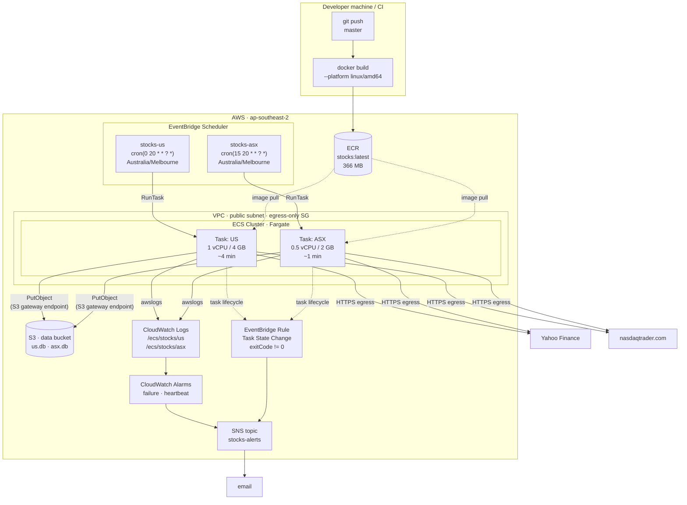
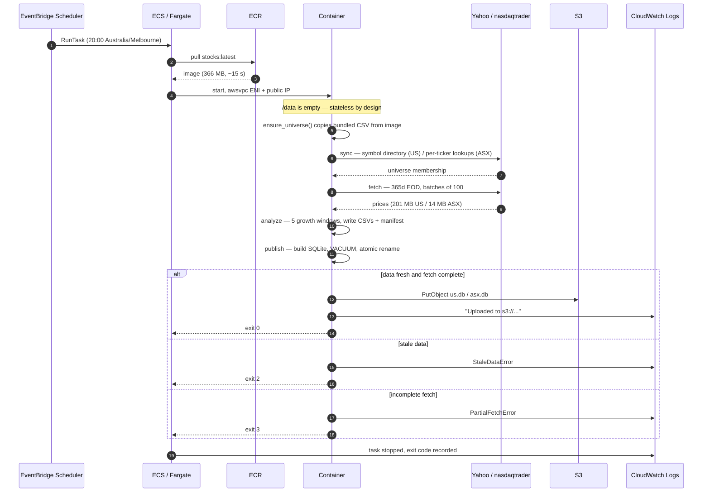
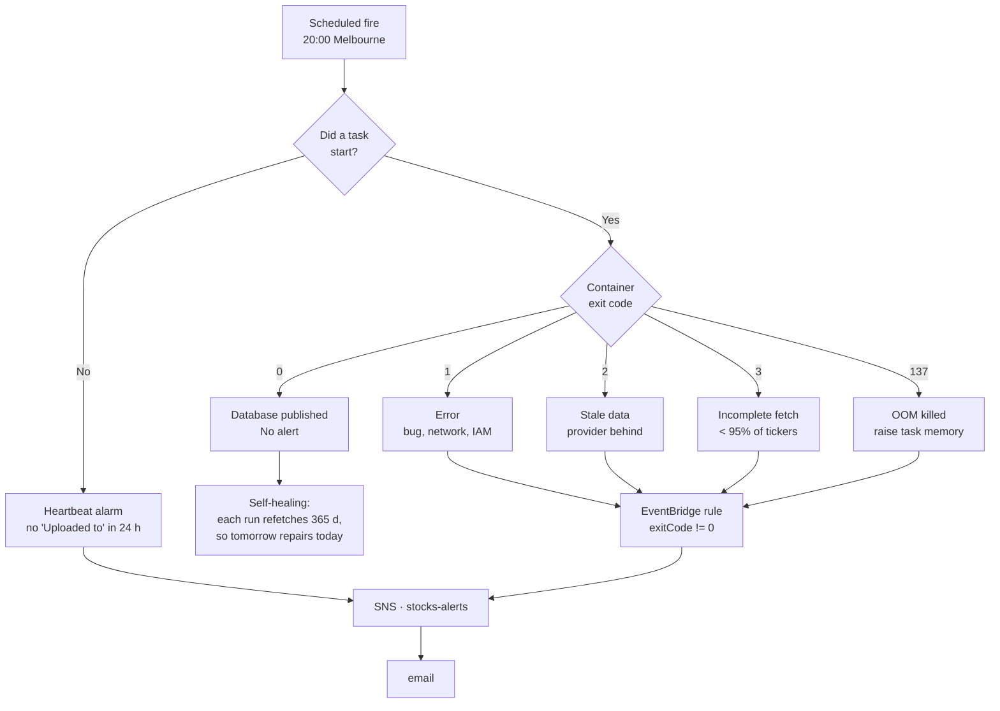
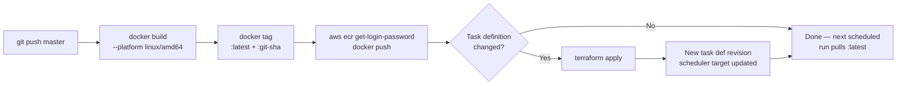

# AWS Deployment Spec — Stock Growth Screener

**Status:** Draft for review
**Date:** 2026-08-23
**Target account:** supplied via `terraform.tfvars` (not committed)
**Target region:** `ap-southeast-2` (Sydney)
**Schedule:** Daily, 20:00 `Australia/Melbourne`

---

> **Placeholders.** This document is public. `${AWS_ACCOUNT_ID}`,
> `${DATA_BUCKET}` and the alert address are deliberately not written down
> here — they live in `infra/terraform.tfvars`, which is gitignored. Substitute
> them locally; do not commit the resolved values.

---

## 1. Purpose and scope

Run the existing pipeline on a daily schedule in AWS with no host involvement:
build the image once, run it on Fargate, publish the SQLite databases to S3,
and get told when something breaks.

**In scope:** ECR, ECS on Fargate, EventBridge Scheduler, S3, CloudWatch Logs
and Alarms, SNS, IAM, and the VPC plumbing the task needs.

**Out of scope:** serving the databases to consumers (a Lambda/API in front of
S3 is a separate piece of work), multi-region, and any change to how growth is
measured.

---

## 2. What exists today

The pipeline is a single image driven by `src/run.py`, which takes a job name
and a universe:

```
python src/run.py all --exchange US --instrument-type stocks --period 365
```

Jobs are `sync`, `fetch`, `analyze`, `publish`, and `all`. Exit codes are
already stable and documented, which the alarm design in §8 depends on:

| Code | Meaning |
|---|---|
| 0 | Success |
| 1 | Error |
| 2 | Price data too stale to screen |
| 3 | Fetch too incomplete to publish |

### 2.1 Measured behaviour

All figures below were measured on 2026-08-23 against the live provider, using
the same code the container runs. They drive the task sizing in §6.2 and the
cost model in §10 — none of it is estimated from first principles.

| Stage | US (5750 tickers) | ASX (402 tickers) |
|---|---|---|
| `sync` | 6.2 s, 122 MB peak | 42.9 s, 131 MB peak |
| `fetch` | 3 m 42 s, **950 MB peak** | 17 s |
| `analyze` | 5 s, 402 MB peak | 0.3 s |
| `publish` + upload | ~2 s | ~1 s |
| **`all`, end to end** | **~4 min** | **~1 min** |

Artefact sizes:

| Artefact | US | ASX |
|---|---|---|
| Universe CSV | 1.0 MB (13,135 symbols) | 24 KB (404 symbols) |
| EOD price CSV | 201 MB | 14 MB |
| Published database | 884 KB | 48 KB |
| Container image | 366 MB (shared) | |

The ASX `sync` figure is the one that surprises: ASX has no bulk symbol
directory, so it does 404 per-ticker provider lookups. It dominates the ASX
run at 43 s of the ~60 s total.

---

## 3. Key design decisions

### D1 — The task is stateless. No EFS.

**This is the decision that keeps the architecture small**, so it is worth
justifying carefully. Every artefact the pipeline produces is regenerated from
scratch on each run:

- **US universe** — `sync` rebuilds membership from the NASDAQ symbol
  directory. A function of the directory, not of the previous run.
- **ASX universe** — `refresh_universe(prune=True)` reads the universe file,
  enriches each ticker from the provider, and drops what the provider no longer
  lists. Starting from the snapshot baked into the image gives the same result
  as starting from yesterday's output. Verified: the bundled
  `config/asx_etf.csv` and the live volume copy are both 404 rows and have not
  diverged.
- **EOD prices** — refetched in full every run (`--period 365`).
- **Databases** — rebuilt from that run's CSVs, then published atomically.

So a container that starts with an empty `/data` produces byte-equivalent
output to one that starts with last night's volume. **No EFS, no S3 state
sync, no volume of any kind.** The image is the source of truth for ASX
membership, which is already true today — new ASX ETFs arrive only by editing
`config/asx_etf.csv` in the repository, because there is no directory to sync
from.

The 201 MB EOD CSV lives on Fargate's ephemeral storage (20 GB by default),
which is ample.

**Consequence worth stating:** a failed run is not data loss. Each run fetches
a full year, so tomorrow's run fully repairs a day that was missed. This is
why §8 does not specify automatic retries.

### D2 — EventBridge Scheduler, not a CloudWatch Events rule

The request said "CloudWatch alarms to run every day at 8 PM Melbourne time".
Two corrections, one of them load-bearing:

1. **Alarms do not schedule anything.** They watch a metric and fire a
   notification. They are used in this design for *failure detection* (§8),
   which is what you actually want them for.
2. **A classic CloudWatch Events / EventBridge *rule* only understands UTC.**
   Melbourne observes daylight saving — AEST (UTC+10) in winter, AEDT (UTC+11)
   in summer. A UTC cron fixed at `10:00` would drift to 9 PM local in October
   and back to 8 PM in April.

**EventBridge Scheduler** (the newer service) accepts an IANA timezone
directly and handles the transitions:

```hcl
schedule_expression          = "cron(0 20 * * ? *)"
schedule_expression_timezone = "Australia/Melbourne"
```

It also gives a native ECS `RunTask` target, retries, and an optional dead
letter queue, none of which the older rule offers cleanly.

### D3 — Two schedules and two task definitions, not one

US and ASX differ by a factor of four in runtime and a factor of seven in
memory. Running them as one task would mean paying US-sized memory for the ASX
work, and a US provider outage would take the ASX results down with it. Two
independent schedules cost nothing extra and fail independently.

### D4 — Public subnet with a public IP. No NAT Gateway.

The task needs outbound HTTPS to `query1/query2.finance.yahoo.com` and
`www.nasdaqtrader.com`. The two ways to get it:

| Option | Cost | Notes |
|---|---|---|
| Public subnet + `assignPublicIp=ENABLED` | ~$0.02/mo | Public IPv4 billed at $0.005/hr, and only while the task runs (~3 hrs/month) |
| Private subnet + NAT Gateway | **~$43/mo** | ~200× the cost of everything else in this design combined |

A public IP is not an exposure here: the security group allows **egress only**,
there is no inbound rule, and the task listens on nothing. NAT would be buying
a lower reachability surface for a task that has no listening surface to begin
with.

An **S3 Gateway VPC Endpoint** is added regardless — it is free, and it keeps
the database upload off the public path entirely.

### D5 — S3 is the only durable store

Databases land at the bucket root, matching what the code already does
(`upload_to_s3` keys on the basename). Nothing else is persisted.

---

## 4. Architecture



### 4.1 Why the two schedules are 15 minutes apart

Both could run at 20:00. Staggering to 20:00 and 20:15 means the ASX run — the
short, cheap one — is not queued behind a US image pull, and the two produce
cleanly separated log streams for the heartbeat alarms. There is no hard
dependency between them.

---

## 5. Scheduling and data availability

The 8 PM Melbourne slot needs checking against both markets' close times,
because a screen that runs before the data exists exits 2 and publishes
nothing.

```mermaid
gantt
    title A single Melbourne day (AEST, UTC+10)
    dateFormat HH:mm
    axisFormat %H:%M

    section ASX
    Trading session (10:00-16:00)   :done, asx, 10:00, 6h
    EOD available                   :milestone, 16:30, 0m

    section US (prior session)
    US close 16:00 ET = 06:00 Melb  :milestone, 06:00, 0m
    EOD available                   :milestone, 07:00, 0m

    section Pipeline
    US run    (~4 min)              :crit, 20:00, 12m
    ASX run   (~1 min)              :crit, 20:15, 6m
```

**ASX.** The session closes at 16:00 Melbourne. A 20:00 run is four hours
clear, and same-day ASX EOD data is published well before then.

**US.** At 20:00 Melbourne on day *D*, the most recent completed US session is
*D−1* in US calendar terms — the NYSE closed at 16:00 ET, which is roughly
06:00–08:00 Melbourne on *D*, depending on the two DST offsets. So a run on *D*
screens US data stamped *D−1*. That is expected and correct; it is exactly what
today's manual runs produce (`us.db` currently has `data_as_of = 2026-08-21`
from a run on 2026-08-22).

**Weekends.** `max_data_age_days: 5` is the guard. Worst case is a Monday
20:00 Melbourne run, where the last US session was the previous Friday — three
days back, inside the limit. No weekend day exceeds it.

**Should weekends run at all?** Saturday and Sunday runs re-screen unchanged
data and republish an identical database. They are harmless and idempotent, and
at ~$0.005 per run not worth optimising away. Keeping the schedule at seven
days a week also means the heartbeat alarm in §8.3 has no weekend exceptions to
encode. Daily it is.

### 5.1 DST transitions

| Date | Melbourne | UTC equivalent of 20:00 |
|---|---|---|
| Winter (Apr–Oct) | AEST, UTC+10 | 10:00 UTC |
| Summer (Oct–Apr) | AEDT, UTC+11 | 09:00 UTC |

EventBridge Scheduler handles the shift. The transition days themselves are
benign here: 20:00 is nowhere near the 02:00–03:00 window where a local time can
be skipped or repeated, so the schedule fires exactly once on every calendar day
of the year.

---

## 6. Component specifications

### 6.1 ECR

| Property | Value |
|---|---|
| Repository | `stocks` |
| Tag strategy | `latest` plus immutable `git-<short-sha>` |
| Scan on push | Enabled |
| Encryption | AES256 |
| Lifecycle policy | Expire untagged after 7 days; keep last 10 tagged |

At 366 MB, ten retained images cost about $0.37/month in storage.

**Build must target `linux/amd64`.** Fargate x86 will not run an arm64 image,
and a build from an Apple Silicon or ARM host silently produces one:

```bash
docker build --platform linux/amd64 -t stocks:latest .
```

### 6.2 ECS task definitions

Sizing is derived from the §2.1 measurements, with headroom rounded to the
nearest valid Fargate CPU/memory combination.

| | US | ASX |
|---|---|---|
| CPU | 1024 (1 vCPU) | 512 (0.5 vCPU) |
| Memory | 4096 MB | 2048 MB |
| Measured peak RSS | 950 MB | ~131 MB |
| Headroom | 4.3× | 15× |
| Ephemeral storage | 20 GiB (default) | 20 GiB (default) |
| Peak disk use | ~210 MB | ~15 MB |
| Command | `all --exchange US --instrument-type stocks --period 365` | `all --exchange ASX --instrument-type etf --period 365` |
| Expected runtime | ~4 min | ~1 min |

Both use `requiresCompatibilities: ["FARGATE"]`, `networkMode: awsvpc`, and
`operatingSystemFamily: LINUX` / `cpuArchitecture: X86_64`.

The generous memory headroom is deliberate: the fetch stage's peak scales with
universe size, and the US universe grows as the symbol directory does. A task
killed by the OOM killer produces exit code 137 and no output, which is a bad
failure mode to economise into. The cost of the extra 2 GB is under $0.02/month.

**Environment:**

| Variable | Value | Purpose |
|---|---|---|
| `STOCKS_DATA_ROOT` | `/data` | Already baked into the image |
| `S3_BUCKET` | `s3://${var.data_bucket}` | Upload target; value lives in tfvars |
| `S3_REGION` | `ap-southeast-2` | |
| `S3_AUTO_UPLOAD` | `true` | Makes the upload routine without `--upload` |
| `TZ` | `UTC` | Container-internal; the exchange calendar is resolved via `zoneinfo` |

**No credentials in the environment and no secrets.** The task role supplies S3
access; the provider needs no API key. There is nothing for Secrets Manager or
SSM Parameter Store to hold, which removes a whole class of rotation work.

### 6.3 Logging

Two log groups, one per universe, so the heartbeat metric filters in §8.3 get
clean per-universe metrics without log-stream gymnastics:

| Log group | Retention |
|---|---|
| `/ecs/stocks/us` | 30 days |
| `/ecs/stocks/asx` | 30 days |

Driver `awslogs`, with `awslogs-stream-prefix = "ecs"`. At a few hundred KB per
run, retention cost is negligible; 30 days is enough to investigate a failure
without becoming an archive.

### 6.4 S3

The existing data bucket in `ap-southeast-2` already holds
`us.db` and `asx.db` at the root — the layout `upload_to_s3` produces, since it
keys on the basename.

| Setting | Value | Rationale |
|---|---|---|
| Versioning | **Enabled** | A bad screen overwrites the only good copy otherwise. Cheap at ~1 MB/day. |
| Lifecycle | Expire noncurrent versions after 30 days | Bounds the versioning cost |
| Public access | Fully blocked | |
| Encryption | SSE-S3 | |

Versioning is the one change recommended to the existing bucket. Without it,
a run that publishes a subtly wrong database destroys the last good one, and
§3/D1 only guarantees you can *rebuild* — not that you can get back the exact
artefact a downstream consumer already read.

### 6.5 IAM

Three roles, each minimal.

**Task execution role** — used by the ECS agent, not by your code. Pulls the
image and writes the log stream:

- `AmazonECSTaskExecutionRolePolicy` (AWS managed)

**Task role** — assumed by the container itself. This is the only identity your
code uses, and it needs exactly one thing:

```json
{
  "Version": "2012-10-17",
  "Statement": [{
    "Effect": "Allow",
    "Action": ["s3:PutObject"],
    "Resource": ["arn:aws:s3:::${DATA_BUCKET}/us.db",
                 "arn:aws:s3:::${DATA_BUCKET}/asx.db"]
  }]
}
```

Scoped to the two exact keys. The pipeline never reads from S3 (see D1) and
never lists the bucket, so `GetObject` and `ListBucket` are deliberately
absent. This replaces the long-lived IAM user credentials the local runs use
today — nothing needs `aws configure export-credentials` in AWS.

**Scheduler role** — assumed by EventBridge Scheduler to launch the task:

- `ecs:RunTask` on the two task definition ARNs
- `iam:PassRole` on the task and execution roles, conditioned on
  `iam:PassedToService = ecs-tasks.amazonaws.com`

---

## 7. Run sequence



---

## 8. Failure handling and alarms

This is where CloudWatch alarms genuinely belong. Three distinct failure modes,
each needing a different detector.



### 8.1 Non-zero exit — EventBridge rule

An alarm on a metric is the wrong tool for a discrete event. An EventBridge
rule on the ECS task lifecycle is exact and immediate:

```json
{
  "source": ["aws.ecs"],
  "detail-type": ["ECS Task State Change"],
  "detail": {
    "clusterArn": ["arn:aws:ecs:ap-southeast-2:${AWS_ACCOUNT_ID}:cluster/stocks"],
    "lastStatus": ["STOPPED"],
    "containers": { "exitCode": [{ "anything-but": 0 }] }
  }
}
```

A second rule catches failures where the container never ran at all — image
pull failure, ENI allocation failure — matching on `stoppedReason` with
`lastStatus: STOPPED` and no `exitCode` present.

### 8.2 Silent upload skip — log metric filter

The upload block is conditional on `S3_BUCKET` and `S3_AUTO_UPLOAD`. If either
goes missing from the task definition, the run **succeeds with exit 0** and
publishes nothing to S3. That exact failure already happened once locally and
is why `run.py` now logs the skip explicitly.

| Metric filter | Pattern | Alarm |
|---|---|---|
| `UploadSkipped` | `"Skipping S3 upload"` | ≥ 1 in 24 h → alert |

Without this, a misconfigured task definition looks perfectly healthy.

### 8.3 Missed run — heartbeat alarm

Nothing above fires if the scheduler never triggers, or the task is stuck in
`PROVISIONING`. A heartbeat catches it:

| Metric filter | Pattern | Alarm |
|---|---|---|
| `UploadSucceeded` (per log group) | `"Uploaded to s3://"` | `< 1` over 24 h, `treat_missing_data = "breaching"` |

`treat_missing_data = "breaching"` is the essential part — a total absence of
logs is precisely the condition being detected, and the default
(`missing`) would leave the alarm in `INSUFFICIENT_DATA` and silent.

CloudWatch's maximum alarm period is 24 h, so this is a single 24-hour
period with one evaluation period — detection lands within roughly a day of a
missed run. Do not raise it to two evaluation periods reaching for a "26 hour"
tolerance: that gives 48-hour detection, not 26.

### 8.4 Retries — deliberately omitted

EventBridge Scheduler's `retry_policy` retries the **`RunTask` API call**, not a
task that ran and exited non-zero. Retrying on exit code needs Step Functions
wrapping the `ecs:runTask.sync` integration.

That is not worth building for Phase 1, because of the self-healing property in
D1: every run refetches a full year, so a failure costs one day of freshness
and tomorrow's run repairs it completely. Step Functions is listed in §13 as
future work for when the freshness requirement tightens.

---

## 9. Build and deploy flow



Because the schedule targets a task definition family (not a pinned revision)
and the image tag is `latest`, a plain image push is enough for a code change.
Terraform is only needed when sizing, environment, or schedule changes.

**The stale-image trap applies here too.** `COPY src/ ./src/` bakes the code
into the image; pushing to `master` without rebuilding leaves Fargate running
the old code indefinitely, with no signal that it is doing so. Tagging each
image `git-<short-sha>` alongside `latest` makes it possible to confirm from
the ECR console which commit is actually running.

---

## 10. Cost estimate

Fargate on-demand, `ap-southeast-2`, at roughly $0.04856/vCPU-hour and
$0.00532/GB-hour. **Verify current rates against the AWS pricing page before
committing to these numbers.**

| Item | Basis | Monthly |
|---|---|---|
| Fargate — US | 1 vCPU + 4 GB × 4 min × 30 | $0.14 |
| Fargate — ASX | 0.5 vCPU + 2 GB × 1 min × 30 | $0.02 |
| Public IPv4 | $0.005/hr × ~2.5 hr | $0.02 |
| ECR storage | 10 images × 366 MB × $0.10/GB | $0.37 |
| S3 storage | ~1 MB live + 30 versions | $0.01 |
| S3 requests | ~60 PUT/month | negligible |
| CloudWatch Logs | ~10 MB ingest + 30 d retention | $0.05 |
| CloudWatch Alarms | 4 alarms × $0.10 | $0.40 |
| SNS | < 100 messages | negligible |
| Data transfer in | 215 MB/day from provider | **free** |
| **Total** | | **≈ $1.01/month** |

The alarms cost more than the compute. Note what is *absent*: no NAT Gateway
($43), no EFS ($0.30/GB-month plus throughput), no always-on anything. Data
transfer *in* from Yahoo is free, which matters because it is 6.5 GB/month.

---

## 11. Application changes required

The pipeline runs on Fargate **as-is** — D1 means there is no state plumbing to
write. Three small items are worth addressing, none blocking:

| # | Item | Severity | Detail |
|---|---|---|---|
| 1 | `sync` and `fetch` jobs also upload | ~~Low~~ **Fixed** | The upload block in `run.py` ran for every job, so `sync` alone re-uploaded the *existing* database — one stamped with an earlier run's `run_id` and `data_as_of`. Now gated on `PUBLISHING_JOBS`; `--upload` on a non-publishing job is an error rather than a silent no-op. |
| 2 | No `--platform` guard | Low | An arm64 build fails on Fargate x86 at task start with an exec format error. Document in the deploy runbook, or pin `--platform linux/amd64` in a Makefile target. |
| 3 | `min_success_ratio` default 0.95 | Info | The US fetch reliably loses 1–3 tickers to provider rate limiting (1/5750 on the last three runs). Well inside the threshold, but if the provider degrades, exit 3 is the designed response and the alarm in §8.1 will report it. |

Item 1 was the only one worth a code change before go-live, and is done.

---

## 12. Terraform layout

```
infra/
├── main.tf              providers, backend, locals
├── network.tf           VPC, public subnet, IGW, SG, S3 gateway endpoint
├── ecr.tf               repository + lifecycle policy
├── ecs.tf               cluster, two task definitions
├── iam.tf               execution, task, scheduler roles
├── schedule.tf          two EventBridge Scheduler schedules
├── observability.tf     log groups, metric filters, alarms, SNS, EventBridge rules
├── variables.tf
└── outputs.tf
```

State in S3 with DynamoDB locking, or Terraform Cloud — not local, since the
schedule is a shared production resource.

### 12.1 The schedule resource

The centrepiece, and the piece most easily got wrong:

```hcl
resource "aws_scheduler_schedule" "us" {
  name       = "stocks-us"
  group_name = "default"

  flexible_time_window {
    mode                      = "FLEXIBLE"
    maximum_window_in_minutes = 15
  }

  schedule_expression          = "cron(0 20 * * ? *)"
  schedule_expression_timezone = "Australia/Melbourne"   # DST-aware — see D2

  target {
    arn      = aws_ecs_cluster.stocks.arn
    role_arn = aws_iam_role.scheduler.arn

    ecs_parameters {
      task_definition_arn = aws_ecs_task_definition.us.arn
      launch_type         = "FARGATE"
      task_count          = 1

      network_configuration {
        subnets          = [aws_subnet.public.id]
        security_groups  = [aws_security_group.egress_only.id]
        assign_public_ip = true                            # see D4
      }
    }

    retry_policy {
      maximum_event_age_in_seconds = 3600
      maximum_retry_attempts       = 2   # RunTask API only — not exit codes
    }

    dead_letter_config {
      arn = aws_sqs_queue.scheduler_dlq.arn
    }
  }
}
```

`FLEXIBLE` with a 15-minute window is intentional: nothing downstream depends
on the exact minute, and it lets AWS spread the invocation. Set it to `OFF` if
you later want the run pinned to 20:00 precisely.

### 12.2 The egress-only security group

```hcl
resource "aws_security_group" "egress_only" {
  name        = "stocks-task"
  description = "Outbound HTTPS only; no inbound"
  vpc_id      = aws_vpc.stocks.id

  egress {
    description = "HTTPS to provider and AWS APIs"
    from_port   = 443
    to_port     = 443
    protocol    = "tcp"
    cidr_blocks = ["0.0.0.0/0"]
  }

  # No ingress block. The task listens on nothing.
}
```

---

## 13. Rollout plan

| Phase | Work | Exit criteria |
|---|---|---|
| 0 | ~~Fix §11 item 1~~ (done); enable S3 versioning | Upload gated on publish ✓; versioning on |
| 1 | Terraform network, ECR, IAM | `terraform apply` clean; image pushed |
| 2 | Task definitions; run each **manually** via `aws ecs run-task` | Both exit 0; `us.db`/`asx.db` timestamps update in S3 |
| 3 | Observability — log groups, filters, alarms, SNS | Force a failure (bad bucket name) and confirm the email arrives |
| 4 | Enable the two schedules | Three consecutive nights green |
| 5 | Decommission the local cron, if any | — |

**Do not skip phase 3's forced failure.** An alarm that has never fired is an
untested alarm, and the failure mode this whole design guards against is the
silent one.

### 13.1 Future work

- **Step Functions** wrapping `ecs:runTask.sync`, if same-day freshness ever
  becomes a hard requirement (§8.4).
- **Fargate Spot** — up to 70% cheaper, and the workload is entirely
  interruption-tolerant given D1's self-healing property. Deferred only because
  the absolute saving is about $0.14/month.
- **Container Insights** to confirm the §2.1 memory measurements hold in
  Fargate, then tighten the task sizing.
- **A query layer** in front of S3 — Lambda + API Gateway, or Athena over the
  CSVs — so consumers do not each download the database.

---

## 14. Open questions

1. **Alert recipient** — which address subscribes to `stocks-alerts`?
2. **Existing VPC** — this spec creates a dedicated VPC. If the account has one
   already, point the task at an existing public subnet and drop `network.tf`.
3. **Terraform state backend** — S3 + DynamoDB, or Terraform Cloud?
4. **ASX universe additions** — new ASX ETFs still arrive only by editing
   `config/asx_etf.csv` and rebuilding the image. Acceptable, or should
   phase 2 add a discovery source?
5. **`consistent_growth_stocks` is currently 0 rows for ASX** — a real screening
   outcome, not a bug, but worth deciding whether an empty table should itself
   raise a low-severity alert.
